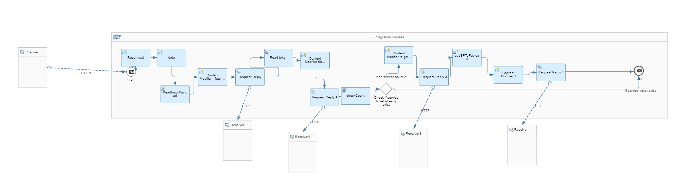

# iFlow Definitions




## Creating iFlow to trigger Service Call creation via Field Service Management API

1.	**Read Input** - Input is read from the Action Payload
2.	Data - Input is kept in a variable called `property.msg`
3.	**ReadInputPayload** - equipment_id, problemType, inputPayload is fetched from the msg. Also, account, company and user is fetched from the msg headers.
4.	**Token Fetch** - An http call is prepared to fetch token from FSM.
5.	**Request Reply** - The call to get token is fired and response is received.
6.	**Read Token** - Token from the call is saved in the access_token propety of the message.
7.	**Call to fetch existing tickets** is prepared - A post call is prepared with access_token, X-Client-ID and X-Client-Version in the headers. Body of the message has the query - Fetch service call and equipment id from the existing list of service calls where equipment id is same as the equipment id from step 3 `and` equipment id exists in the service call's list of equipments `and` status code is not -4 or -1 (closed or cancelled) `and` problem type is same as the incoming problem type.
8.	**Request Reply** - Call is executed and response is received.
9.	**Check Count** - Count of such tickets is retreived from the response.
10.	If the count is 0, proceed with service call creation to step 11. If the count is more than 0, End (16).
11.	**Call to fetch BP** - Another call is prepared to fetch the Business Partner of the current Equipment.
12.	**Request Reply** - Call is fired and response received.
13.	**Get BP** - Business Partner information is added in the call to create a service ticket along with other details. Due Date time is updated as the next day.
14.	Final call to **create service ticket** - A call to FSM is prepared with all the details collected in the above steps.
15.	**Request Reply** - Call is fired and response received.
16.	**End**

## Importing the iFlow from sample application

This sample application contains an iFlow definition to create service calls in Field Service Management that can be used in Actions Modeler.

Please follow below steps to import the iFlows.

* Navigate and Open [Access_Token_FSM.iflw](../iFlows/FSMServiceCallWithDynamicParams/src/main/resources/scenarioflows/integrationflow/Access_Token_FSM.iflw) file.

* Replace the placeholders with relevant values as explained below.

|Place Holder Name|Details| Example |
|---|---|---|
|&lt;&lt;FSM_ACCOUNT_NAME&gt;&gt;| FSM Account Name ||
|&lt;&lt;CORE_SYSTEM_HOST_URL&gt;&gt;| Core System Host URL |https://us.coresuite.com|
|&lt;&lt;FSM_USER&gt;&gt;| FSM Username |
|&lt;&lt;FSM_PASSWORD&gt;&gt;| FSM Password |

* Navigate to  [iFlows/FSMServiceCallWithDynamicParams](../iFlows/FSMServiceCallWithDynamicParams) and create archive file (zip file ).
* Zip file internal file structure should look like as per below.
```bash
├── META-INF
│   ├── MANIFEST.MF
├── src
│   ├── main
│   │   ├── resources
│   │   │	├── scenarioflows
│   │   │	│	├── integrationflow
│   │   │	│	│	├── Access_Token_FSM.iflw
│   │   │	├── script
│   │   │	│	├── GetId&Voltage.js
│   │   │	│	├── checkCount.js
│   │   │	│	├── getBP.js
│   │   │	│	├── get_access_token.js
│   │   │	├── parameters.prop
│   │   │	├── parameters.propdef
└── .project
```
* Launch the Cloud Platform Integration Cockpit and login with the respective credentials.
* Import the archive file, this should create an iFlow called "FSMServiceCallWithDynamicParams".
* Deploy the iFlow by clicking on the "Deploy" button.
* After successful deployment, navigate to "Operations View => Manage Integration Content".
* Select the iFlow by the name "FSMServiceCallWithDynamicParams".
* Copy the iFlow URL listed under "Endpoints" tab right side.


### Possible problem type values for Field Service Management
	-1(Electrical)
	-2(Mechanical)
	-3(User Error)
	-4(Third Party)
	-5(Unknown)