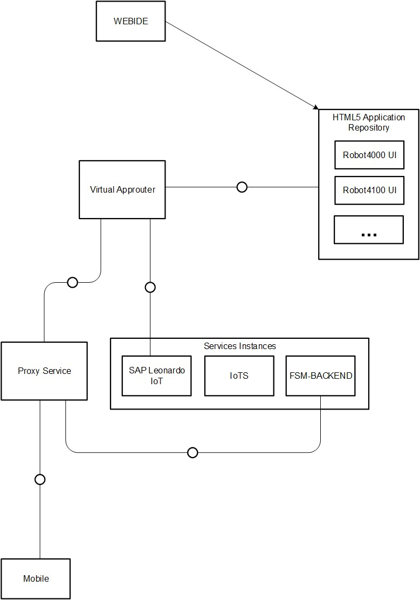
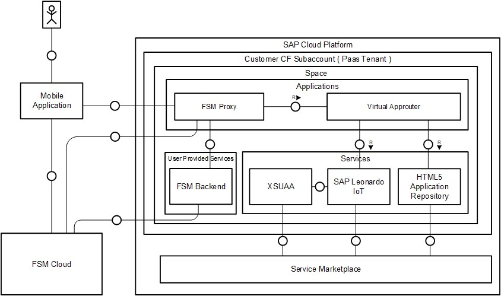
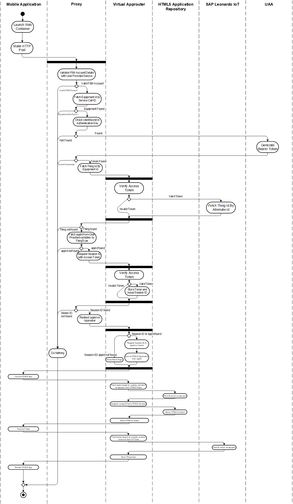

# Initial Setup

## Building Blocks
- Approuter to visualize HTML5 applications
- Proxy to Retrieve the Web Container Calls from FSM Mobile and Forward to Approuter
- HTML5 Applications
- SAP Leonardo IoT Service Instance
- FSM Cloud

##### Here is a barebone diagram of building blocks

 


## Architecture



## User workflow




## Onboarding Documentation

### Leonardo IoT Service Instance

[SAP Leonardo IoT - SAP Help Portal](https://help.sap.com/viewer/product/SAP_Leonardo_IoT/1905a/en-US)

Create the Service Instances of SAP Leonardo IoT inside the tenant space.
A detailed information to create a service instance can be found [here](https://help.sap.com/viewer/65de2977205c403bbc107264b8eccf4b/Cloud/en-US/8221b7434d8e484fab5ec5d219b7bf64.html).

Create the Service Keys for the above created Service Instance for later uses.
A detailed information to create service keys can be found [here](https://help.sap.com/viewer/65de2977205c403bbc107264b8eccf4b/Cloud/en-US/4514a14ab6424d9f84f1b8650df609ce.html).

Note down the service instance name and uaa credentials of Leonardo IoT Service.

* Now launch the Terminal/MS-DOS prompt and navigate to the cloned repository location.
* Login to Cloud Foundry using "[cf login](https://docs.cloudfoundry.org/cf-cli/getting-started.html#login)"


### FSM-BACKEND User Provided Service

Obtain Field Service Management Account details and fill [fsm-backend.json](/fsm-backend.json) file as per below.

```json
{
	"endpoints":{
		"query":"/api/query/v1"
	},
	"cloudAccount" : "<<FSM_ACCOUNT_NAME>>",
	"objectType" : "SERVICECALL",
	"companyName" : "<<COMPANY_NAME>>",
	"desc": "Account Description",
	"user": "<<USER_NAME>>",
	"password": "<<PASSWORD>>",
	"sap.cloud.service":"scenario.com.sap.leonardo.iot.fsm"
}
```
NOTE: Replace the placeholders enclosed within '&lt;&lt;' and '&gt;&gt;' with FSM Account details.

This file is used by proxy application to validate the incoming call from Mobile Web Container. Incorrect configuration of t his file would result in failure of Web Container workflows.

Execute the below command to create an user provided service with above json.

```
cf create-user-provided-service fsm-backend -p fsm-backend.json
```

### Approuter Configuration

Edit manifest.yml file located in [approuter/manifest.yml](../approuter/manifest.yml) and replace the placeholder called "<<LEONARDO_IOT_SERVICE>>" with the Service Instance name of Leonardo IoT.

For example: If the service instance name is "leonardo_iot_service", then this file should look like this.

<pre>
---
applications:

- name: fsm-approuter
  host: fsm-approuter
  path: virtual-approuter-0.0.1-SNAPSHOT.war
  buildpack: sap_java_buildpack
  parameters:
    memory: 256M
  env:
    TARGET_RUNTIME: tomee
    JBP_CONFIG_RESOURCE_CONFIGURATION: "['tomee/conf/server.xml': {'connector.maxHttpHeaderSize':32768}]"
    destinations: >
      [
        {"name": "IOTAS_CONTROLS","url": "https://sapuiiot.cfapps.eu10.hana.ondemand.com", "forwardAuthToken": false, strictSSL:false }
      ]
  services:
    - fsm_html5_repo_runtime
    <s>- &lt;&lt;LEONARDO_IOT_SERVICE&gt;&gt;</s>
    - leonardo_iot_service

</pre>

Deploy the approuter by executing the below command from [approuter](../approuter) folder

```
cf push -f manifest.yml
```

Note down the generated host URL for the approuter application after the successful deployment. 

### HTML5 Application Configuration


* HTML5 Application has been maintained in a folder called "[html5-app](../html5-app)"

* This application contains an example HTML5 application visualize thing data for the selected device of Type `<<TENANT-PACKAGE-NAMESPACE>>.fsm.demo:Robot4000` where as `<<TENANT-PACKAGE-NAMESPACE>>` refers to the tenant package namespace. 


* In this folder ([html5-app/ui](../html5-app/ui)), find and replace the all placeholders with actual values in all matched files as explained below.

|Placeholder|Details|More Information
|---|---|---|
|&lt;&lt;TENANT-PACKAGE-NAMESPACE&gt;&gt;|Tenant Package Namespace|Please refer [SAP Help Portal](https://help.sap.com/viewer/080fabc6cae6423fb45fca7752adb61e/1905a/en-US/462b49382316427aa59fe671a75fa39e.html) for more details|
|&lt;&lt;TENANT-PACKAGE-NAMESPACE-UNDERSCORE-WITHOUT-DOTS&gt;&gt;|Tenant Package Namespace with dot symbols replaced by underscore symbols||


* Build the html5 application using below command inside "[html5-app](../html5-app)" folder.
```
java -jar <path-to-mta-archive-builder>\mta_archive_builder.jar --build-target=CF build
```
Please refer [Building MTA applications](https://help.sap.com/viewer/58746c584026430a890170ac4d87d03b/Cloud/en-US/9f778dba93934a80a51166da3ec64a05.html) and [Deploying MTA applications](https://github.com/cloudfoundry-incubator/multiapps-cli-plugin#usage) from SAP Help Portal to understand the MTA Build and deployment. 

* Deploy the generated html5-app.mtar using below command

```
cf deploy html5-app.mtar
```

### Proxy Application Configuration

Navigate to proxy application located in [proxy](../proxy) folder.
build the proxy application using below command

```
mvn clean build 
```

Edit manifest.yml file of proxy application located at [proxy/manifest.yml](../proxy/manifest.yml) 

Replace the place holders as explained below.

| Place holder Name                            | Description                                    | More Information                                                                                                                |
|----------------------------------------------|------------------------------------------------|---------------------------------------------------------------------------------------------------------------------------------|
| &lt;&lt;APPROUTER_HOST&gt;&gt;                              | Generated Approuter HOST URL                    |                                                                                                                                 |
| &lt;&lt;SAP_LEONARDO_IOT_UAA_HOST_URL&gt;&gt;                                | UAA URL for Leonardo IoT Instance         |                                                                                                                                 |
| &lt;&lt;CLIENT_ID&gt;&gt;                            | UAA clientId for Leonardo IoT Instance     |                                                                                                                                 |
| &lt;&lt;TENANT-PACKAGE-NAMESPACE&gt;&gt;                 | Tenant Namespace                               | [Documentation](https://help.sap.com/viewer/080fabc6cae6423fb45fca7752adb61e/1905a/en-US/462b49382316427aa59fe671a75fa39e.html) |

Deploy the proxy application using below command.
```
cf push -f manifest.yml
```

Note down the generated HOST URL of proxy application


### Web Container Configuration

* Launch [Coresuite of FSM](https://my.coresuite.com) and login to using the FSM credentials
* Navigate to **Settings** -> **Web Containers** -> **Web Containers**.
* Click on "Create New" button, this will add a form in the right side pane.
* Fill the form as per below.

```
Name : "EquipmentIoTData"
URL : "<<PROXY_HOST_URL>>/iotData"
Authentication Key : "<<CLIENT_SECRET>>"
Object Type : "Service Call"
```

Replace "&lt;&lt;PROXY_HOST_URL&gt;&gt;" with the generated proxy application host url and "&lt;&lt;CLIENT_SECRET&gt;&gt;" with UAA client secret of Leonardo IoT Service Instance. 


Now the setup has been completed.

### Accessing IoT Data from Web Container
* Install FSM Mobile application on iPhone mobile
* Click on Calender and choose a Date
* Recently generated Service calls will be listed here
* Navigate to Service Call and click the menu list at top right corner
* You should see a menu called "Equipment Data", click this menu
* IoT Application will render the Equipment data from Leonardo IoT


### Build HTML5 applications to support additional thing types by using Web-IDE

Follow [these](03-build-html5-app-from-WebIDE.md) steps to develop an IoT Application and deploy it on CF using Web-IDE.
