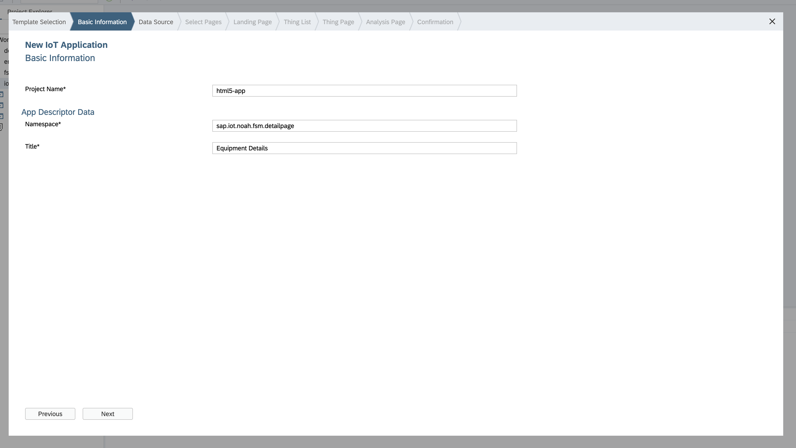
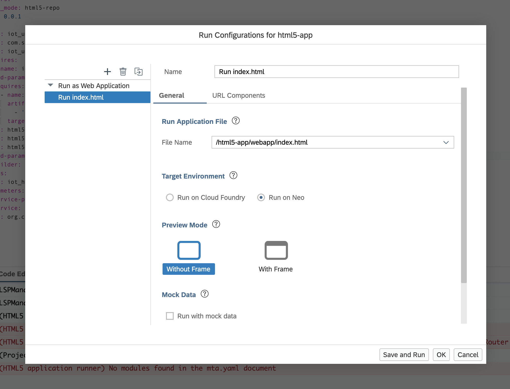
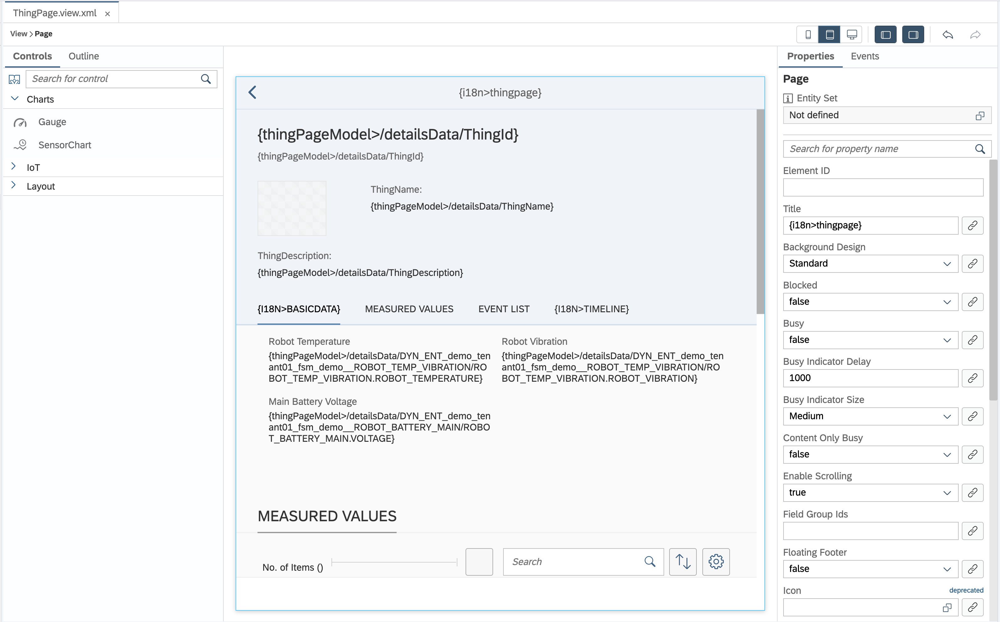
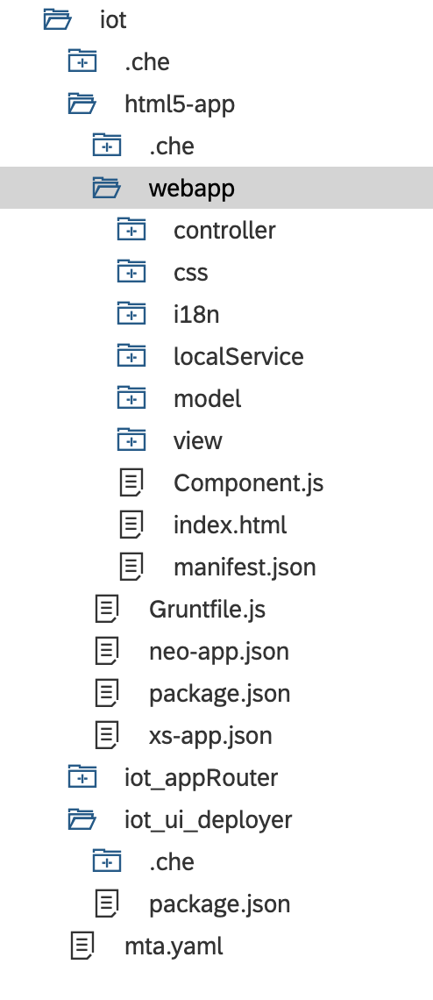
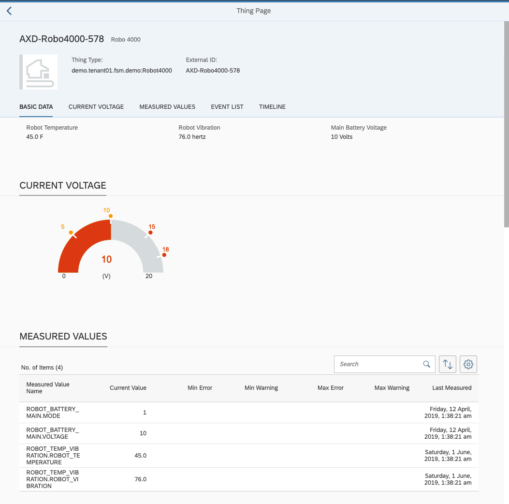

# Creating an application using the **IoT Application** template from Web IDE

## Enabling IoT controls and templates
Once you have the access to the Web IDE, enable the IoT templates by navigating to `Settings`->`Extensions` and enable `Story Board, Layout Editor, Leonardo IoT`.

## Updating IoT Destinations for consuming the services
Navigate to `Tools`->`Update IoT Destinations` and fill the credentials of the tenant where all the artifacts have been configured.

## Creating an IoT Application under Multi-Target Application
1.	Navigate to **Development** tab from the left pane and right click on *Workspace* to navigate to **New** -> **Project from Template**. Select **Multi-Target Application** and proceed.

2.	Give a Project Name and click on Next.

3.	Make sure you select *Use HTML5 Application Repository* and Finish. This creates a Multi-Target Application without any HTML5 Application within this project.

4.	Right click on the created project and navigate to **New** -> **HTML5 Module** and select **IoT Application** and proceed.

5.	Give a Project Name, Namespace and Title. Make sure the Namespace is unique from any other HTML5 Application that is created on this space and deployed in the HTML5 Application repository. Click on Next.

Refer Example Screenshot Below:


6.	Select **IOT-ADVANCEDLIST-THING-ODATA** service from the list of services available in the dropdown and Choose the Thing Types for which is the application is targetted. Select all PSTs for this Thing Type.

7.	Follow the steps to create the template application. Few configuration changes can be made in the Visual Layout Editor during the setup of the application. For example, fields that need to visualised in different screens of the template can be configured in the next steps.

8.	Open the mta.yaml inside the Project and remove the entries for module Approuter and services `html5-apps-repo`->`app-runtime`, `xsuaa` and `destination`. For reference, check the below snapshot.

<pre>
ID: iot
_schema-version: '2.1'
parameters:
  deploy_mode: html5-repo
version: 0.0.1
modules:
  <s>- name: iot_appRouter
    type: approuter.nodejs
    path: iot_appRouter
    parameters:
      disk-quota: 256M
      memory: 256M
    requires:
      - name: iot_html5_repo_runtime
      - name: uaa_iot</s>
  - name: iot_ui_deployer
    type: com.sap.html5.application-content
    path: iot_ui_deployer
    requires:
      - name: iot_html5_repo_host
    build-parameters:
      requires:
        - name: html5-app
          artifacts:
            - './*'
          target-path: resources/html5-app
  - name: html5-app
    type: html5
    path: html5-app
    build-parameters:
      builder: grunt
resources:
  <s>- name: iot_html5_repo_runtime
    parameters:
      service-plan: app-runtime
      service: html5-apps-repo
    type: org.cloudfoundry.managed-service</s>
  - name: iot_html5_repo_host
    parameters:
      service-plan: app-host
      service: html5-apps-repo
    type: org.cloudfoundry.managed-service
  <s>- name: uaa_iot
    parameters:
      path: ./xs-security.json
      service-plan: application
      service: xsuaa
    type: org.cloudfoundry.managed-service
  - name: dest_iot
    parameters:
      service-plan: lite
      service: destination
    type: org.cloudfoundry.managed-service</s>
</pre>

8.	Application Setup in the Web-IDE is complete.

## Running the Application from Web-IDE

Navigate to the HTML5 Application inside the project and right click on webapp to go to Run -> Run Configurations. Select `Run index.html` and choose the Target environment as `Run on Neo`. Click on Save and Run to run this Application through web-ide.



## Navigating directly to a Detail Page

After launching the application from the Web IDE, append any of the patterns listed in the manifest.json under `sap.ui5`>`routing`. For example, to navigate to the Thing Page, append the following after the Application URL-
`#/thingpage/<thing_id>/<thing_type>`. Any thing page related changes can be made and verified at this URL.

Sample URL to be appended - `#/thingpage/FAB5D5968C1849E384467E1AC9F9DD60/<<TENANT-PACKAGE-NAMESPACE>>.fsm.demo:Robot4000`

## Making changes in the Object Page Layout

By default, the ThingPage will render an Object Page Layout that displays Header Section with different attributes and a Thing Image. The Sub-Sections of this page include Basic Data, Measured Values, Event List and Event Timeline.

Navigate to the web app folder inside the application and go to *view->ThingPage.view.xml*. Right click on this file and open with **Layout Editor**. The bindings can be edited in this screen.

### Updating the Bindings

For example click on one of the text in Basic Data section and change the texts shown on the right pane. Similarly, change the binding by replacing with the correct PST name and property.
Ex: Add the following if you want to show the Temperature `{thingPageModel>/detailsData/DYN_ENT_<<TENANT-PACKAGE-NAMESPACE-UNDERSCORE-WITHOUT-DOTS>>_fsm_demo__ROBOT_TEMP_VIBRATION/ROBOT_TEMP_VIBRATION.ROBOT_TEMPERATURE} C`

If you want to show a property directly associated to the thing:
Binding - `{thingPageModel>/detailsData/<property_name>}`
If you want to bind a property of a PST:
Binding - `{thingPageModel>/detailsData/<entity_type_name>/<property_name>}`
Or 
`{thingPageModel>/detailsData/<entity_type_name>/<property_name>} <unit_of_measure>`

This is how a Layout Editor looks like:


Few properties cannot be edited in this editor, for example - Object Page Header section.

To update this, open the `ThingPage.view.xml` using **Code Editor** and the bindings can be updated in exactly the same way. Find and replace the bindings, which needs to be changed.

## Enabling the HTML5 Application to be deployed on CF landscape

For a better understaning of the structure of the UI code, refer the following image:  



Following updates need to be made to run the IoT Template Application on CF:

### Register module path for IoT Controls

Navigate to `Component.js` inside the webapp folder of HTML5 Application, and add the following line at the beginning of this file.

```js
jQuery.sap.registerModulePath("sap.ui.iot", "/destinations/iotas-controls/sap/ui/iot");
```

### Updating the xs-app.json of UI application

The defaut `xs-app.json` inside the UI application is consumed when the application is deployed on CLoud Foundry. Since, the services available in the landscape needs to be consumed, the content of the xs-app.json also has to be updated.

```json
{
	"welcomeFile": "/sap.iot.noah.fsm/webapp/index.html",
	"authenticationMethod": "route",
	"logout": {
		"logoutEndpoint": "/do/logout"
	},
	"routes": [{
		"source": "^/BusinessSystems01/(.*)$",
		"service": "com.sap.leonardo.iot",
		"endpoint": "analytics-thing-sap",
		"target": "$1",
		"authenticationType": "xsuaa"
	}, {
		"source": "^/IOTAS-ADVANCEDLIST-THING-ODATA/(.*)$",
		"service": "com.sap.leonardo.iot",
		"endpoint": "advancedlist-thing-sap",
		"target": "$1",
		"authenticationType": "xsuaa"
	}, {
		"source": "^/IOTAS-COMPOSITE-EVENTS-ODATA/(.*)$",
		"service": "com.sap.leonardo.iot",
		"endpoint": "composite-events-odata",
		"target": "$1",
		"authenticationType": "xsuaa"
	}, {
		"source": "^/IOTAS-DETAILS-THING-ODATA/(.*)$",
		"service": "com.sap.leonardo.iot",
		"endpoint": "details-thing-sap",
		"target": "$1",
		"authenticationType": "xsuaa"
	}, {
		"source": "^/destinations/iotas-controls/(.*)$",
		"destination": "IOTAS_CONTROLS",
		"target": "$1",
		"csrfProtection": false
	}, {
		"source": "^(.*)$",
		"target": "$1",
		"service": "html5-apps-repo-rt",
		"authenticationType": "xsuaa"
	}]
}
```

After these changes are made, the HTML5 Application is ready to be deployed on Cloud Foundry. Right click on the project folder and click build to build to entire Multi-Target Application. This will create an mtar file inside mta_archives folder.

Once the build is successful, open the mta_archives folder, right click on the mtar and click on deploy. After this, select the API endpoint where the application needs to be deployed, including the org and space and deploy the application.

## Enabling the consumption of HTML5 Application through web containers

The user of the FSM Mobile application accesses this HTML5 for a particular thing_id and thing_type, hence couple of configuration changes are required for the UI to work with the web containers and to directly launch the detail page of this HTML5 Application.

### Updating the ThingPage.controller.js

The `_onRouteMatched` method inside `ThingPage.controller.js` file needs to be udpated.  
Replace the first line inside this function:

`var arg = oEvent.getParameter("arguments");`

with the following

```js
// reading the query parameters from the URL
var oParameterMap = sap.ui.getCore().getModel("v-approuter-parameter-model").getData();
// create a map of url parameters
var arg;
// When web container is run
if (oParameterMap.thingId && oParameterMap.thingType) {
	arg = {thingId: oParameterMap.thingId, thingType: oParameterMap.thingType};
} else {	// when developing through web-ide
	arg = oEvent.getParameter("arguments");
}
```

### Directly launching Detail Page

#### Update in `manifest.json`

Under routes in manifest.json, update the target as `thingpage` for the first entry with name `landingpage`.

#### Update in `ThingPage.controller.js`

Inside the `onInit` function update the following line:

```js
oRouter.getRoute("thingpage").attachMatched(this._onRouteMatched, this);
```
with
```js
oRouter.getRoute("landingpage").attachMatched(this._onRouteMatched, this);
```

##### Registration of HTML5 application appId for respective ThingType in Proxy application to be done.
* To do this, open [proxy/manifest.yml](../proxy/manifest.yml) and modify the environment variable called "HTML5_APPLICATIONS" and add a new json object inside with Thing Type and appId Entries.
* Redeploy the proxy application by executing below command inside [proxy](../proxy) folder.

NOTE : One thing type can be mapped only with one appId & Approuter always server the latest version of HTML5 applications deployed in HTML5 Application Repository.

```
cf push -f manifest.yml
```


These changes will make sure that the web container launches the detail page directly from the FSM Mobile Application.

## Running Application through web-ide

For local development of the application, 2 changes need to be made -

1.	Revert the changes made in section 'Directly Launching Detail Page'.
2.	Revert the change mentioned in section 'Register module path for IoT Controls'.

## Adding a new Section/control in this layout

This feature is not yet supported directly from the layout editor, hence code editor needs to be used.
Open ThingPage.view.xml.
Each section of the object page layout is under <ObjectPageSection> tag of the xml. To replace a section or to add a new section, content inside this section needs to be replaced or new ObjectPageSection needs to be added.

## Creating a IoT Gauge control in this section

Copy paste the content of ObjectPageSection at the same level with existing sections and remove everything inside <blocks> tag. Add the following piece of code inside the <blocks> tag.

```xml
<iot:IoTGauge xmlns:cd="http://schemas.sap.com/sapui5/extension/sap.ui.core.CustomData/1" cd:w5g.dt.context="/Things/DYN_ENT_<<TENANT-PACKAGE-NAMESPACE-UNDERSCORE-WITHOUT-DOTS>>_fsm_demo__ROBOT_BATTERY_MAIN" value="{thingPageModel>/detailsData/DYN_ENT_<<TENANT-PACKAGE-NAMESPACE-UNDERSCORE-WITHOUT-DOTS>>_fsm_demo__ROBOT_BATTERY_MAIN/ROBOT_BATTERY_MAIN.VOLTAGE}" minValue="0" maxValue="20" unitOfMeasure="V" lowerWarning="5" upperWarning="10" lowerError="15" upperError="18" id="tgauge0"/>
```

The value of properties like `minValue, maxValue, unitOfMeasure, lowerWarning, upperWarning, lowerError` etc can be edited based on the use case.

Running the Object Page after changes will render the Object Page something like this:  


## Adding a new Data Source to consume in the application
1.	Locate `manifest.json` inside webapp folder of the application and open it (using descriptor editor). Go to `Data Sources` and add a new data source by clicking on `+` icon.

2.	Select service name as `BusinessSystem01` and give relative URL as the name of your PST. (`/PST_Name`) Example: `/<<TENANT-PACKAGE-NAMESPACE>>.fsm.demo:ROBOT_BATTERY_MAIN`. This should list 2 entity types - **aggregates** and **measures**. Select the root and continue.

3.	Give a model name. Example - `MainBatteryAnalytics`. This model can be used to render time depemndant data in the application through a Chart, Table, etc. Save the manifest.json.

This model can be consumed in the application and new controls can be created in the ThingPage.view.controller for it to appear on the web container application.

